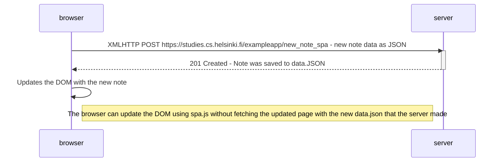

```mermaid
sequenceDiagram
    participant browser
    participant server

    browser->>server: XMLHTTP POST https://studies.cs.helsinki.fi/exampleapp/new_note_spa - new note data as JSON
    activate server
    server-->>browser: 201 Created - Note was saved to data.JSON
    deactivate server

    browser->>browser: Updates the DOM with the new note
    activate server

    Note right of browser: The browser can update the DOM using spa.js without fetching the updated page with the new data.json that the server made


```
